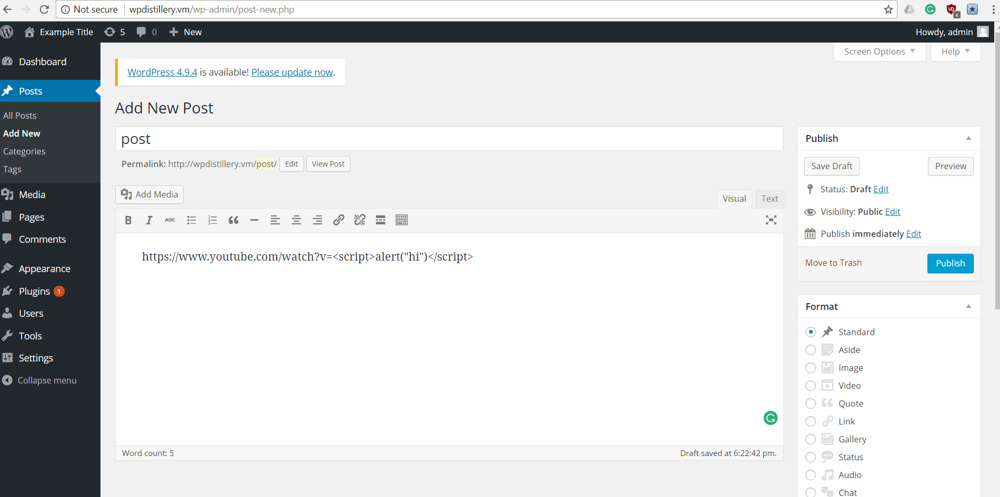
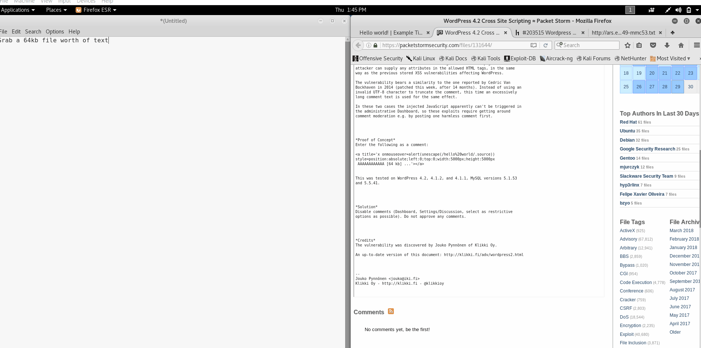

# Project 7 - WordPress Pentesting

Time spent: **6.5** hours spent in total

> Objective: Find, analyze, recreate, and document **five vulnerabilities** affecting an old version of WordPress

## Pentesting Report

1. (Required) Vulnerability Name or ID
  - [ ] Summary: Authenticated Stored Cross-Site Scripting (XSS) in YouTube URL Embeds
    - Vulnerability types: XSS
    - Tested in version: 4.2
    - Fixed in version: 4.2.13
  - [ ] GIF Walkthrough: 
  - [ ] Steps to recreate:
  1. Find a youtube video and copy the url up to the v=
  2. After the v=, insert a javascript message, i.e. 
  3. Copy this new URL and press into insert/edit link button
  4. Press Add Link
    - [ ] Affected source code: wp-includes/media.php
    - [Link 1](https://github.com/WordPress/WordPress/commit/419c8d97ce8df7d5004ee0b566bc5e095f0a6ca8)
1. (Required) Vulnerability Name or ID
  - [ ] Summary: Authenticated Stored Cross-Site Scripting (XSS)
    - Vulnerability types: XSS
    - Tested in version: 4.2
    - Fixed in version: 4.2.3
  - [ ] GIF Walkthrough: 
  - [ ] Steps to recreate:
  1. Create javascript code something like this: <a href="[caption code=">]</a><a title=" onmouseover=alert('hi')  ">link</a>
  2. Log in as someone who can make posts
  3. Paste the javascript into a post
  4. Submit the post
  - [ ] Affected source code:
    - [Link 1](https://core.trac.wordpress.org/changeset?sfp_email=&sfph_mail=&reponame=&old=33316%40branches%2F4.2&new=33316%40branches%2F4.2&sfp_email=&sfph_mail=)
1. (Required) Vulnerability Name or ID
  - [ ] Summary: Unauthenticated Stored Cross-Site Scripting (XSS)
    - Vulnerability types: XSS
    - Tested in version: 4.2
    - Fixed in version: 4.2.1
  - [ ] GIF Walkthrough: 
  - [ ] Steps to recreate:
    1. Create a comment as a user
    2. Paste a piece of javascript code that you want to use followed by 64kb of text.
    3. Post the comment, when an admin sees, the comment it will execute the script
  - [ ] Affected source code:
    - [Link 1](https://core.trac.wordpress.org/browser/tags/4.2.1/src/wp-includes/kses.php)

## Assets

List any additional assets, such as scripts or files

## Resources

- [WordPress Source Browser](https://core.trac.wordpress.org/browser/)
- [WordPress Developer Reference](https://developer.wordpress.org/reference/)

GIFs created with [LiceCap](http://www.cockos.com/licecap/).

## Notes

Describe any challenges encountered while doing the work

Many of the vulnerabilities involved tools or techniques that we weren't acquainted with so one of the major difficulties was finding hacks
that wouldn't require learning entirely new skillsets.
## License

    Copyright [yyyy] [name of copyright owner]

    Licensed under the Apache License, Version 2.0 (the "License");
    you may not use this file except in compliance with the License.
    You may obtain a copy of the License at

        http://www.apache.org/licenses/LICENSE-2.0

    Unless required by applicable law or agreed to in writing, software
    distributed under the License is distributed on an "AS IS" BASIS,
    WITHOUT WARRANTIES OR CONDITIONS OF ANY KIND, either express or implied.
    See the License for the specific language governing permissions and
    limitations under the License.
